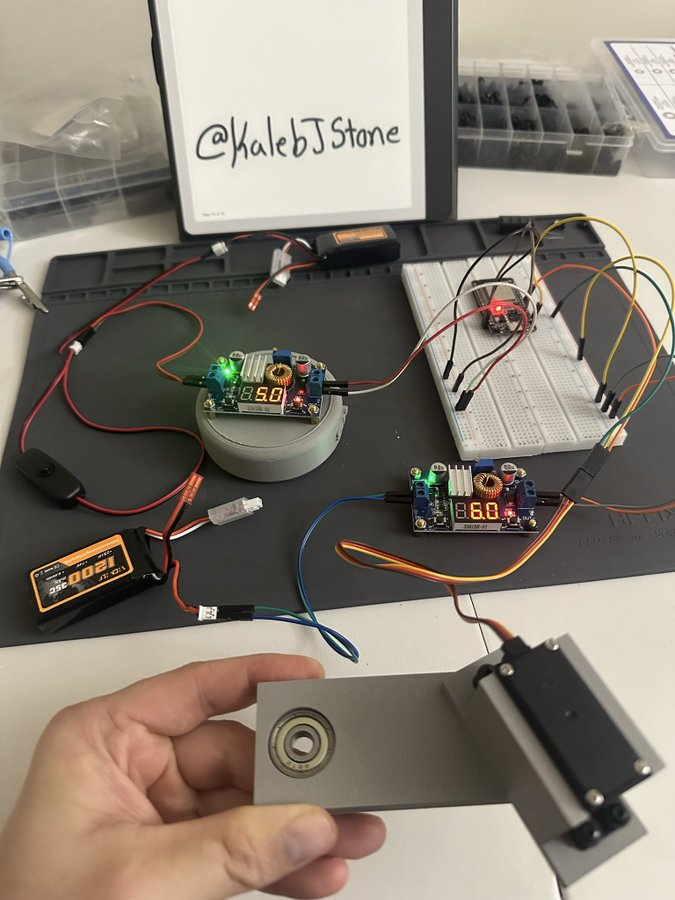

# Project Eragon

**A compact, mostly 3D-printed bipedal walking robot (~30 cm tall / 1 ft)** built as a hands-on robotics learning project.

Eragon is a small-scale biped designed to showcase servo control, basic gait generation, balance, and real-world mechanical/electrical integration

## Progress
- **3D Printer Ready**
- Utilizing/Learning FreeCAD
- Testing End-to-End workflows
- Learning NVIDIA Isaac Sim 
- Researching Mechanical components/best practices
- **Bluetooth-controlled ESP32 Ready** 
- Prepping for ESP32/Pi crosstalk
<tr>
    <td align="center">
        
             <strong>Current Progress:</strong> Designing Pelvis in FreeCAD
    </td>
</tr>

## License
MIT License — feel free to fork, modify, and build your own version!

Stay tuned — updates coming soon!

---
Project Eragon – because even short robots can be mighty.