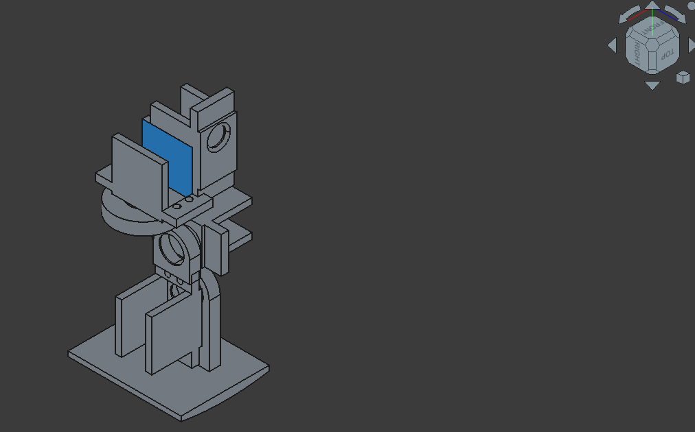

# Project Eragon

**A compact, mostly 3D-printed bipedal walking robot (~30 cm tall / 1 ft)** built as a hands-on robotics learning project.

Eragon is a bipedal robotics platform utilizing a **Distributed Intelligence** architecture. 
This repository contains the "Medulla" (Pi Bridge) and "Reflex" (ESP32 Actuation) layers.

## Progress
- **3D Printer Ready**
- Utilizing/Learning FreeCAD
- Testing End-to-End workflows
- Learning NVIDIA Isaac Sim 
- Researching Mechanical components/best practices
- **Bluetooth-controlled ESP32 Ready** 
- **High Level Code Architecture Ready**
<table>
 <strong>Current Progress:</strong> Designing Pelvis in FreeCAD/Setting up Sim
<tr>
    <td align="center">
        
    </td>
</tr>
<tr>
    <td align="center">
           
    </td>
</tr>
</table>

## System Architecture
* **Medulla:** Coordination, Inverse Kinematics, and Serial Bridge. (Pi)
* **Reflex:** Low-level PWM and sensor feedback. (ESP32)

## License
MIT License — feel free to fork, modify, and build your own version!

---
Project Eragon – because even short robots can be mighty.